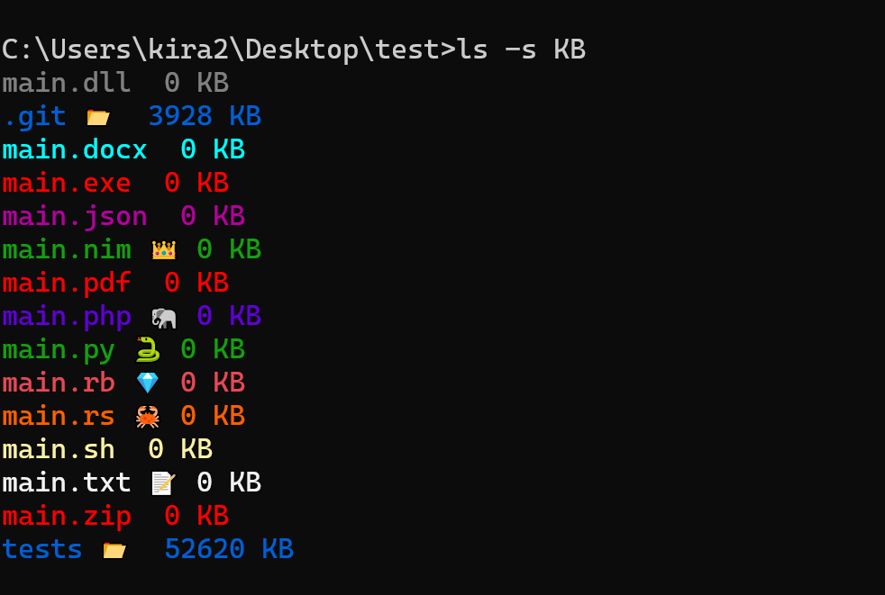

# description 
Like ls command in linux and powershell but with emojis.

# images 

# installation

| 
windows
            | 
linux 
                 | 
OSX
                       |
| ----------------------------------------------------------------------------------------------------------------- | --------------------------------------------------------------------------------------------------------------- | --------------------------------------------------------------------------------------------------------------- | 
| 

 | 

 | 

 | 
| <a href="https://github.com/kira2040k/ls/releases/tag/1.0.0">windows 64 bit</a>              | &nbsp;&nbsp; &nbsp;&nbsp;&nbsp;&nbsp;&nbsp;&nbsp;<a href="https://github.com/kira2040k/ls/releases/tag/1.0.0">linux 64 bit</a>              | &nbsp;&nbsp;&nbsp;&nbsp;&nbsp;&nbsp;&nbsp;&nbsp;&nbsp;&nbsp;                <a href="https://github.com/kira2040k/ls/releases/tag/1.0.0">OSX 64 bit</a>                                                                                               |

